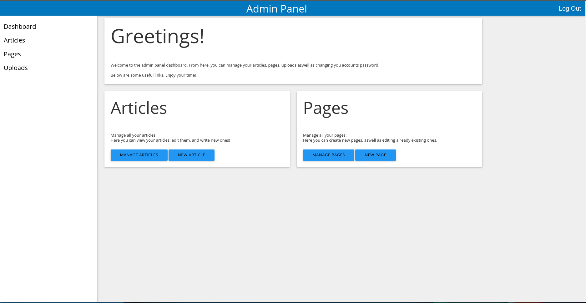

# WebTool (Better name coming soon)
----

A basic CMS written Ruby using Ruby on Rails. Inspired by Jekyll and Wordpress.

I am writing this project as a part of my summer job in China aswell as in the purpose of personal usage later in the future.

### Goals and Aims
------

As stated above, I wrote this project as apart of my summer job in China.
I belive making a rails application would benifit the company I am working for here more than just making a wordpress site.

This is just a usual rails application and can be expanded upon for personal usage. My aim is to make a tool that
can be easily modified and configured without boundaries to the users heartcontent while providing basic features.
Since this is a rails application, the user can add whatever features they want to when using this the same way they do with other
rails applications.

### Some Screenshots
------

##### The Login screen to admin view:

##### The admin Dashboard:

##### More screens:

### Features
-----

As of current, this project only includes the basic features of CMSs, like writing and editing blogpost like articles.
Website pages, and uploading images and files.

Some Additional features also includes:
* Markdown as content bodies
* Materialdesign as design language.
* More comming soon.

### Development and Deployment
------
To develop:
1. Fork and clone.

2. Generate a secret

3. `$ rails s`

4. do whatever you want.

To deploy:
Deploying this as you do with every other rails app is enough. i.e. with Phusion passenger + Apache/Nging
